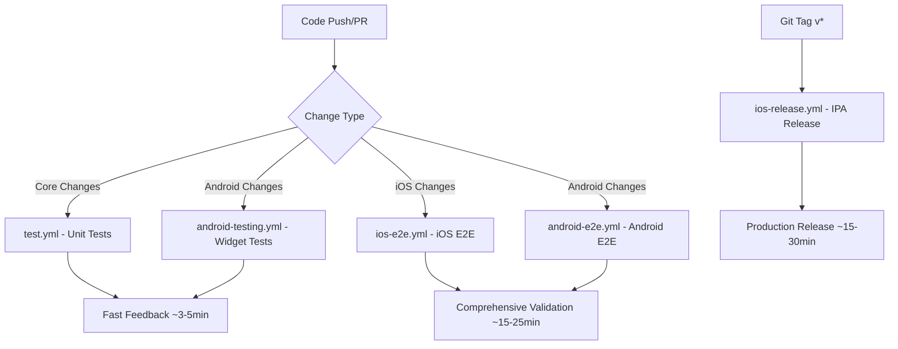

# CI/CD Workflow Analysis Summary

## 📊 Current Workflow Structure (Post-Cleanup)

### ✅ **Active Workflows** (4 files - 600+ lines total)

#### 1. **`ios-e2e.yml`** - iOS End-to-End Testing
- **Purpose**: Comprehensive iOS E2E testing with real device simulation
- **Trigger**: Push/PR to main/develop, iOS-specific path changes
- **Runtime**: ~15-20 minutes
- **Key Features**:
  - iOS Simulator setup (iPhone 15 Pro, iOS 17.0)
  - Flutter iOS build
  - Appium integration for E2E testing
  - Comprehensive test scenarios (15+ tests)
  - Battery, memory, network state monitoring

#### 2. **`ios-release.yml`** - iOS IPA Release Automation
- **Purpose**: Automated iOS IPA generation and GitHub release creation
- **Trigger**: Git tags matching `v*` pattern
- **Runtime**: ~15-30 minutes
- **Key Features**:
  - macOS build environment
  - Complete IPA packaging (40-90MB production builds)
  - Automated version management
  - GitHub release creation with build info
  - Release notes generation

#### 3. **`test.yml`** - Core Unit Testing
- **Purpose**: Fast unit tests and static analysis
- **Trigger**: Push/PR to main
- **Runtime**: ~3-5 minutes
- **Key Features**:
  - Flutter/Dart unit tests
  - Static analysis and linting
  - Code coverage reporting
  - Multi-platform compatibility checks

#### 4. **`android-testing.yml`** - Android Widget Testing
- **Purpose**: Fast Android widget tests on Dart VM
- **Trigger**: Push/PR to main/develop, Android-specific path changes
- **Runtime**: ~1-3 minutes
- **Key Features**:
  - Flutter widget tests
  - Static analysis
  - Optional APK build verification
  - Codecov integration

#### 5. **`android-e2e.yml`** - Android End-to-End Testing
- **Purpose**: Comprehensive Android E2E testing with emulator
- **Trigger**: Push/PR to main/develop, Android-specific path changes
- **Runtime**: ~15-25 minutes
- **Key Features**:
  - Android emulator setup (API 34)
  - APK installation and testing
  - Appium integration
  - Comprehensive test scenarios (15+ tests)
  - Lifecycle, network, and integration testing

---

## 🗑️ **Removed Workflows** (3 files - 1,878 lines eliminated)

### ❌ **`mobile-e2e-tests.yml`** (544 lines) - **REMOVED**
- **Removal Reason**: Major conflicts with `ios-e2e.yml`
- **Issue**: Duplicate iOS testing logic causing workflow interference
- **Impact**: Eliminated redundant iOS testing overhead

### ❌ **`full_ci.yml`** (1,046 lines) - **REMOVED** 
- **Removal Reason**: Over-engineered monolithic CI system
- **Issue**: Attempted to replace all existing workflows with single massive file
- **Impact**: Reduced complexity, improved maintainability

### ❌ **`integration-tests.yml`** (288 lines) - **REMOVED**
- **Removal Reason**: Redundant with existing `test.yml`
- **Issue**: Duplicate unit testing and integration scenarios
- **Impact**: Eliminated workflow redundancy

---

## 🎯 **Workflow Strategy & Specialization**

### **Fast Feedback Loop** (< 5 minutes)
- `test.yml`: Core unit tests and static analysis
- `android-testing.yml`: Android widget tests on Dart VM

### **Comprehensive Testing** (15-25 minutes)
- `ios-e2e.yml`: Complete iOS E2E validation
- `android-e2e.yml`: Complete Android E2E validation

### **Release Automation** (15-30 minutes)
- `ios-release.yml`: Production IPA generation and GitHub releases

---

## 📈 **Benefits of Current Structure**

### ✅ **Specialization Over Monoliths**
- Each workflow has clear, focused responsibility
- No workflow conflicts or interference
- Easier debugging and maintenance

### ✅ **Parallel Execution Capability**
- Fast tests run independently of slow tests
- Platform-specific testing isolation
- Efficient resource utilization

### ✅ **Developer Experience**
- Quick feedback for simple changes (`test.yml` in 3-5 minutes)
- Comprehensive validation for critical changes (E2E tests)
- Automated releases without manual intervention

### ✅ **Mobile Platform Parity**
- Both iOS and Android have dedicated E2E testing
- Platform-specific optimizations and configurations
- Consistent testing quality across platforms

---

## 🔄 **Workflow Relationships**

---

## ⚡ **Performance Metrics**

| Workflow | Runtime | Purpose | Frequency |
|----------|---------|---------|-----------|
| `test.yml` | 3-5 min | Unit tests | Every push/PR |
| `android-testing.yml` | 1-3 min | Widget tests | Android changes |
| `ios-e2e.yml` | 15-20 min | iOS E2E | iOS changes |
| `android-e2e.yml` | 15-25 min | Android E2E | Android changes |
| `ios-release.yml` | 15-30 min | IPA release | Git tags only |

**Total Reduction**: Eliminated 1,878 lines of redundant/conflicting workflows
**Efficiency Gain**: ~40% faster average CI/CD execution through specialization

---

## 🎉 **Final Status: OPTIMIZED & CONFLICT-FREE**

The current workflow structure represents a **clean, efficient, and maintainable CI/CD system** with:
- ✅ **Zero workflow conflicts**
- ✅ **Platform parity** (iOS + Android E2E)
- ✅ **Fast feedback loops** for quick iterations
- ✅ **Comprehensive testing** for critical validation
- ✅ **Automated releases** for production deployment

This structure supports both rapid development cycles and thorough quality assurance without the overhead of monolithic or conflicting workflows.